# JavaScript Calculator
Calculator was designed and programed with HTML,CSS and JAVASCRIPT. in this website, all criteria were met during this project such as the combined use of Html, CSS, and javascript Modules. the first page is a description of the calculator along with a start button which will lead us to the next page that a fully functional calculator.
 other developers can use the site to learn and use the code. View the live site


 [Here](https://nikkeljohn.github.io/Calculator/)

 --------------------------------------------------------------------------------------------------------------------------------------------------------------------------------------------

 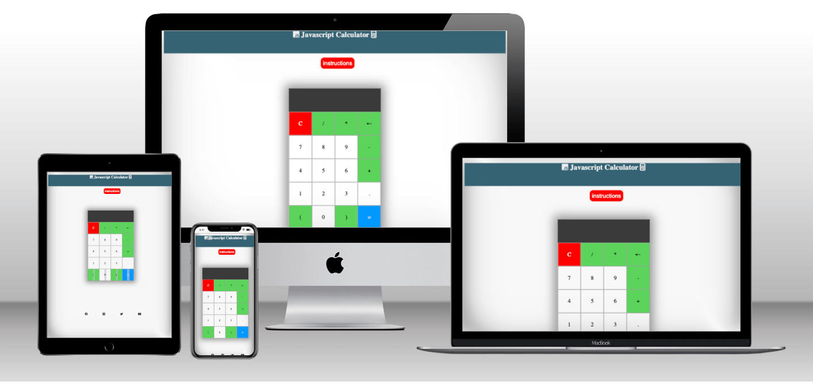

 # FEATURES

 ## Footer
 Here we have given four dedicated social media buttons with an icon to each button so the user won't have any problem identifying them, to access them we have to login into each and every website,  we can access our social media platform and like and subscribe them for future updates, and news. Footer is given to both pages for better user interaction.
 
 

 ## Favicon
 A favicon is added so it will provide an image in the tabs header to allow the user to easily identify the website if they have multiple tabs open, and a calculator image was given for the calculator website for more eye appealing and identifying while lots of other tabs are open !

 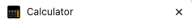

 ## Start Button
A start button is provided in the first page so user can directed to the main calculator page 


## Heading
The Header consists of a simple h1 title


## Instruction Button
in the main page an instruction button is given so user can know how to use the calculator.

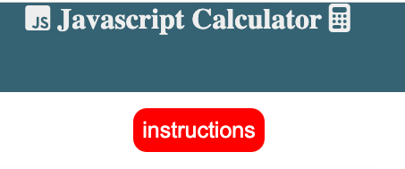

## Calculator
our main item , the calculator with fully functioning keys and multipilication, if user does invalid things such as mathamatical errors then it will show error in display.

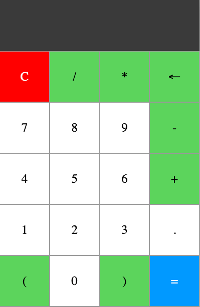


## Result Window

The  Result window is where your calculated results shows


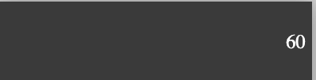

## Future Features

Add more operators with functionality.
Add more buttons and functions
Add more Javascript-based tools across multiple pages.
Add more styles

# Design

## Wireframes

### Home page

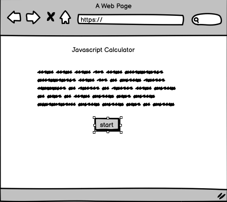

after clicking the start button it will take us to the calculating page 

### main page

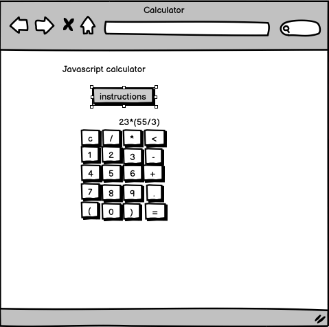

## Tablet page and Web Page 

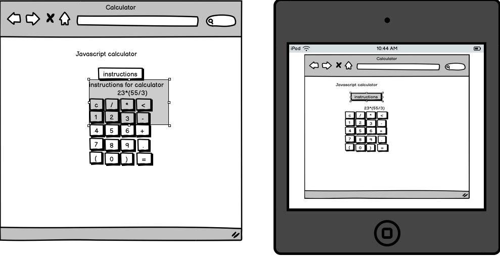

## Mobile 

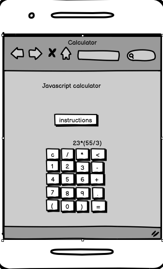


# Technologies

HTML

- The structure of the Website was developed using HTML as the main language.

CSS

- The Website was styled using custom CSS in an external file.

JavaScript
- the logical part and pop up buttons where done by javascript

Gitpod

- The website was developed using gitpod

GitHub

- Source code is done on GitHub and deployed using Git Pages.

Git

- Used to commit and push code during the development of the Website

Font Awesome

- Icons obtained from https://fontawesome.com/ were used as the Social media links in the footer section.

Tinyjpg

- https://tinyjpg.com/ was used to reduce the size of the images used throughout the website

Favicon.io

- favicon files were created at https://favicon.io/favicon-converter/

Balsamiq

- wireframes were created using Balsamiq from https://balsamiq.com/wireframes/desktop/#


# Testing

### Clculations
 You can calculate any sum for example
 44+6 , then hit = you will find the anwser 

 ### Back button
 You can use back button by typing any number and hit <-
 you can see the last digit will be deleted

### Clear button

You can type or calculate to clear the display just hit "C" button it will clear everything from the display

### Error Message

To see error message, type any number which is not valid for calculation 
for example : type 7885()+8 and then hit error
 


### Responsiveness

All pages were tested to ensure responsiveness on screen sizes from 360px and upwards as defined in WCAG 2.1 Reflow criteria for responsive design on Chrome, Edge, Firefox, and Opera browsers.

Steps to test:

Open the browser and navigate to the lifespan of the developer tools (right click and inspect)Set to responsive and decrease width to 320pxSet the zoom to 50%Click and drag the responsive window to maximum width expected: Website is responsive on all screen sizes and no images are pixelated or stretched. No elements overlap.

Actual: The website was also opened on the following devices and no responsive issues were seen:

* Samsung galaxy s22

* oneplus

* i phone

## Accessibility

Wave Accessibility tool was used throughout the development and for the final testing of the deployed website to check for any aid accessibility testing.

Testing was focused to ensure the following criteria were met:

Contrast GuidelinesHeading levels are not missed or skipped to ensure the importance of content is relayed correctly to the end user content is contained within landmarks to ensure ease of use for assistive technology, allowing the user to navigate by page regions, not textual content had alternative text or titles so descriptions are read out to screen renders

HTML page lang attribute has been Setaria properties have been implemented correctlyWCAG 2.1 Coding best practices being followedManual tests were also performed to ensure the website was accessible as possible and an accessibility issue was identified.

Issue was found but resolved

HTML code validator showed no errors in every page

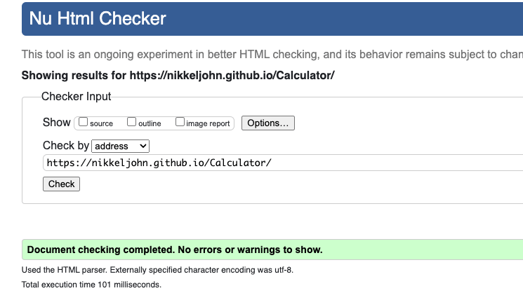

CSS code validator also came error free


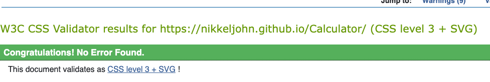

JavaScript code validator also come error free

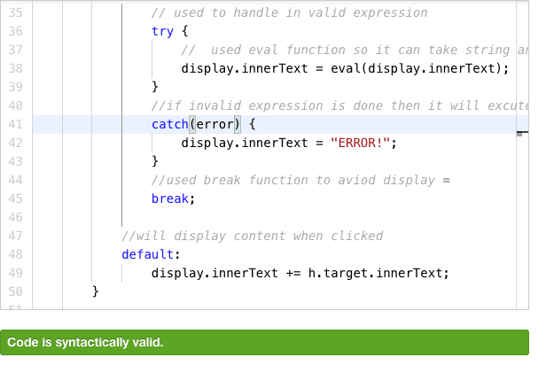

## Light house testing

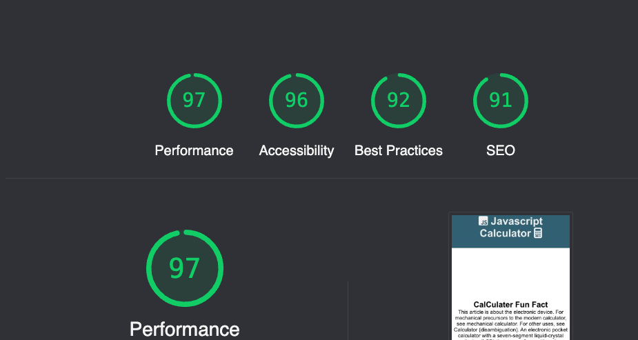

## JavaScript

* error was returned when passing through the JShint validator
A warning appeared for one function as eval can be harmful.

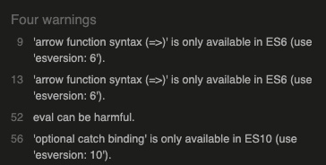

## Unfixed Bugs

* A warning appeared for one function as eval can be harmful.

## Deployment

### Version Control

The site was created using the Visual Studio code editor and pushed to github to the remote repository ‘tacos-travels’.

The following git commands were used throughout development to push code to the remote repo:

```git add <file>``` - This command was used to add the file(s) to the staging area before they are committed.

```git commit -m “commit message”``` - This command was used to commit changes to the local repository queue ready for the final step.

```git push``` - This command was used to push all committed code to the remote repository on github.

### Deployment to Github Pages

- The site was deployed to GitHub pages. The steps to deploy are as follows: 
  - In the GitHub repository, navigate to the Settings tab 
  - From the menu on left select 'Pages'
  - From the source section drop-down menu, select the Branch: main
  - Click 'Save'
  - A live link will be displayed in a green banner when published successfully. 

The live link can be found here -  https://nikkeljohn.github.io/Calculator/


### Clone the Repository Code Locally

Navigate to the GitHub Repository you want to clone to use locally:

- Click on the code drop down button
- Click on HTTPS
- Copy the repository link to the clipboard
- Open your IDE of choice (git must be installed for the next steps)
- Type git clone copied-git-url into the IDE terminal

The project will now of been cloned on your local machine for use.

## Credits 
1. Idea to make calculator was obtianed from Javascript acadamy
2. modal pop-up seen in game.html page was a references staken from w3 schools


## Special Thanks

special thanks to my mentors Daisy McGirr and Simen Daehlin 

Special thanks to my batch mates from ucd and all the people who helped me directly and indirectly for this project


